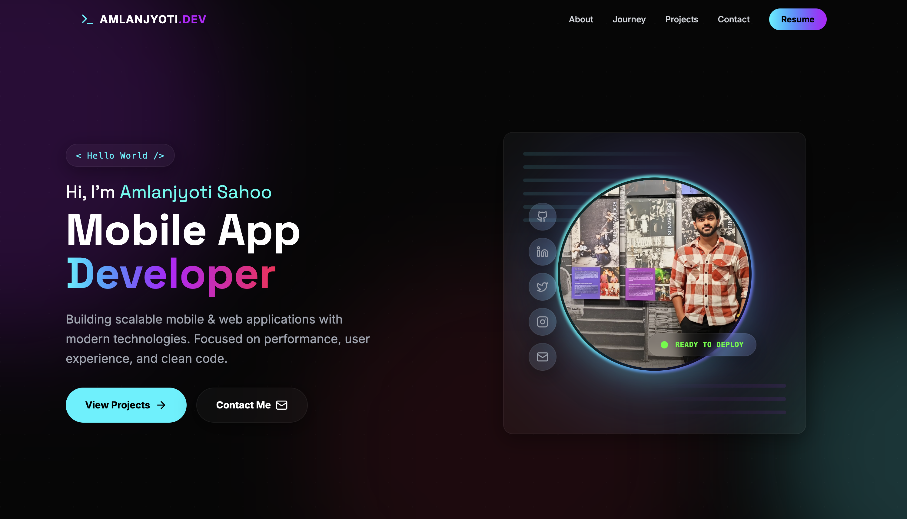

# Amlan Jyoti Sahoo - Portfolio

A modern, responsive, and animated developer portfolio built with React, TypeScript, and Tailwind CSS.

## 🔗 Website Preview
https://amlan-jyoti-sahoo.github.io/portfolio/

<div align="center">
  <a href="https://amlan-jyoti-sahoo.github.io/portfolio/">
    
  </a>
</div>

---

## 🛠️ Data Stack

- **Framework:** [React](https://react.dev/) + [Vite](https://vitejs.dev/)
- **Language:** [TypeScript](https://www.typescriptlang.org/)
- **Styling:** [Tailwind CSS](https://tailwindcss.com/)
- **Animations:** [Framer Motion](https://www.framer.com/motion/)
- **Icons:** [Lucide React](https://lucide.dev/)
- **Email Service:** [EmailJS](https://www.emailjs.com/)

---

## 💻 Getting Started

Follow these steps to run the project locally on your machine.

### Prerequisites

- Node.js installed (v16+ recommended)
- `npm` or `yarn`

### Installation

1. **Clone the repository**
   ```bash
   git clone https://github.com/amlan-jyoti-sahoo/amlan_protfolio_app.git
   cd amlan_protfolio_app
   ```

2. **Install dependencies**
   ```bash
   npm install
   ```

3. **Run the Development Server**
   ```bash
   npm run dev
   ```
   The application will start at `http://localhost:5173`.

---

## 🚀 Deployment

To deploy the latest version to GitHub Pages:

```bash
npm run deploy
```

This command will:
1. Build the project using `npm run build`.
2. Push the contents of the `dist` folder to the `gh-pages` branch.
